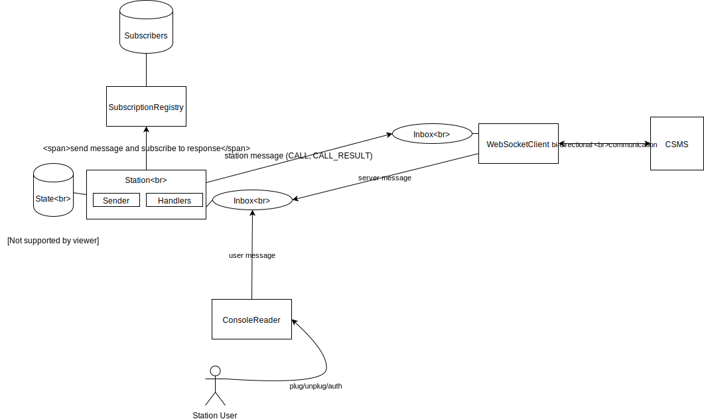

OCPP Station Simulator
======================
The simulator tool is dedicated for simulation of charging station. It implements [OCPP protocol](https://en.wikipedia.org/wiki/Open_Charge_Point_Protocol) and talks to Charging Station Management 
System (CSMS) via WebSocket protocol. At the moment only OCPP 2.0 (download [here](https://www.openchargealliance.org/protocols/ocpp-20/)) is supported.

[](https://circleci.com/gh/evbox/station-simulator)

- [Capabilities](#capabilities)
  * [Supported OCPP messages](#supported-ocpp-messages)
  * [Supported OCPP 2.0 use cases](#supported-ocpp-20-use-cases)
  * [Auto-reconnect](#auto-reconnect)
- [Running](#running)
  * [Available command line options](#available-command-line-options)
  * [Configuration](#configuration)
    + [Command-line configuration](#command-line-configuration)
    + [File-based configuration](#file-based-configuration)
  * [Run as JAR file](#run-as-jar-file)
  * [Use as console tool](#use-as-console-tool)
  * [Use as dependency library](#use-as-dependency-library)
- [Design overview](#design-overview)
- [Contribute](#contribute)
  * [Working in IntelliJ IDEA](#working-in-intellij-idea)
  * [Working in other IDEs](#working-in-other-ides)

-----------

# Capabilities
## Supported OCPP messages
- BootNotification
- Heartbeat
- Authorize
- TransactionEvent
- StatusNotification
- Reset (only IMMEDIATE reset is supported)
- GetVariables
- SetVariables 
- ChangeAvailability
- GetBaseReport (FullInventory and ConfigurationInventory only, monitoring is not supported)

## Supported OCPP 2.0 use cases
| Subject                           | Use Case                                                                    | Supported | Comments                                      |
| :--------------------------------:| :--------------------------------------------------------------------------:| :--------:| :--------------------------------------------:|
| Security                          | A01 - Update Charging Station Password for HTTP Basic Authentication        |           |                                               |
| Security                          | A02 - Update Charging Station Certificate by request of CSMS                |           |                                               |
| Security                          | A03 - Update Charging Station Certificate initiated by the Charging Station |           |                                               |
| Security                          | A04 - Security Event Notification                                           |           |                                               |
| Provisioning                      | B01 - Cold Boot Charging Station                                            | Yes       |                                               |
| Provisioning                      | B02 - Cold Boot Charging Station - Pending                                  |           |                                               |
| Provisioning                      | B03 - Cold Boot Charging Station - Rejected                                 |           |                                               |
| Provisioning                      | B04 - Offline Behavior Idle Charging Station                                |           |                                               |
| Provisioning                      | B05 - Set Variables                                                         | Yes       |                                               |
| Provisioning                      | B06 - Get Variables                                                         | Yes       |                                               |
| Provisioning                      | B07 - Get Base Report                                                       | Yes       | FullInventory and ConfigurationInventory only |
| Provisioning                      | B08 - Get Custom Report                                                     |           |                                               |
| Provisioning                      | B09 - Setting a new NetworkConnectionProfile                                |           |                                               |
| Provisioning                      | B10 - Migrate to new ConnectionProfile                                      |           |                                               |
| Provisioning                      | B11 - Reset - Without Ongoing Transaction                                   | Yes       | Immediate reset only                          |
| Provisioning                      | B12 - Reset - With Ongoing Transaction                                      | Yes       | Immediate reset only                          |
| Authorization                     | C01 - EV Driver Authorization using RFID                                    | Yes       |                                               |
| Authorization                     | C02 - Authorization using a start button                                    |           |                                               |
| Authorization                     | C03 - Authorization using credit/debit card                                 |           |                                               |
| Authorization                     | C04 - Authorization using PIN-code                                          |           |                                               |
| Authorization                     | C05 - Authorization for CSMS initiated transactions                         |           |                                               |
| Authorization                     | C06 - Authorization using local id type                                     |           |                                               |
| Authorization                     | C07 - Authorization using Contract Certificates                             |           |                                               |
| Authorization                     | C08 - Authorization at EVSE using ISO 15118 External Identification Means   |           |                                               |
| Authorization                     | C09 - Authorization by GroupId                                              |           |                                               |
| Authorization                     | C10 - Store Authorization Data in the Authorization Cache                   |           |                                               |
| Authorization                     | C11 - Clear Authorization Data in Authorization Cache                       |           |                                               |
| Authorization                     | C12 - Start Transaction - Cached Id                                         |           |                                               |
| Authorization                     | C13 - Offline Authorization through Local Authorization List                |           |                                               |
| Authorization                     | C14 - Online Authorization through Local Authorization List                 |           |                                               |
| Authorization                     | C15 - Offline Authorization of unknown Id                                   |           |                                               |
| Authorization                     | C16 - Stop Transaction with a Master Pass                                   |           |                                               |
| LocalAuthorizationList Management | D01 - Send Local Authorization List                                         |           |                                               |
| LocalAuthorizationList Management | D02 - Get Local List Version                                                |           |                                               |
| Transactions                      | E01 - Start Transaction options                                             |           |                                               |
| Transactions                      | E02 - Start Transaction - Cable Plugin First                                | Yes       |                                               |
| Transactions                      | E03 - Start Transaction - IdToken First                                     | Yes       |                                               |
| Transactions                      | E04 - Transaction started while Charging Station is offline                 |           |                                               |
| Transactions                      | E05 - Start Transaction - Id not Accepted                                   |           |                                               |
| Transactions                      | E06 - Stop Transaction options                                              |           |                                               |
| Transactions                      | E07 - Transaction locally stopped by IdToken                                | Yes       |                                               |
| Transactions                      | E08 - Transaction stopped while Charging Station is offline                 |           |                                               |
| Transactions                      | E09 - When cable disconnected on EV-side: Stop Transaction                  | Yes       |                                               |
| Transactions                      | E10 - When cable disconnected on EV-side: Suspend Transaction               |           |                                               |
| Transactions                      | E11 - Connection Loss During Transaction                                    |           |                                               |
| Transactions                      | E12 - Inform CSMS of an Offline Occurred Transaction                        |           |                                               |
| Transactions                      | E13 - Transaction-related message not accepted by CSMS                      |           |                                               |
| Transactions                      | E14 - Check transaction status                                              |           |                                               |
| Transactions                      | E15 - End of charging process                                               |           |                                               |
| RemoteControl                     | F01 - Remote Start Transaction - Cable Plugin First                         |           |                                               |
| RemoteControl                     | F02 - Remote Start Transaction - Remote Start First                         |           |                                               |
| RemoteControl                     | F03 - Remote Stop Transaction                                               |           |                                               |
| RemoteControl                     | F04 - Remote Stop ISO 15118 Charging from CSMS                              |           |                                               |
| RemoteControl                     | F05 - Remotely Unlock Connector                                             |           |                                               |
| RemoteControl                     | F06 - Trigger Message                                                       |           |                                               |
| Availability                      | G01 - Status Notification                                                   | Yes       |                                               |
| Availability                      | G02 - Heartbeat                                                             | Yes       |                                               |
| Availability                      | G03 - Change Availability EVSE                                              | Yes       |                                               |
| Availability                      | G04 - Change Availability Charging Station                                  | Yes       |                                               |
| Availability                      | G05 - Lock Failure                                                          |           |                                               |
| Reservation                       | H01 - Reservation                                                           |           |                                               |
| Reservation                       | H02 - Cancel Reservation                                                    |           |                                               |
| Reservation                       | H03 - Use a reserved Connector                                              |           |                                               |
| Reservation                       | H04 - Reservation Ended                                                     |           |                                               |
| TariffAndCost                     | I01 - Show EV Driver-specific Tariff Information                            |           |                                               |
| TariffAndCost                     | I02 - Show EV Driver Running Total Cost During Charging                     |           |                                               |
| TariffAndCost                     | I03 - Show EV Driver Final Total Cost After Charging                        |           |                                               |
| TariffAndCost                     | I04 - Show Fallback Tariff Information                                      |           |                                               |
| TariffAndCost                     | I05 - Show Fallback Total Cost Message                                      |           |                                               |
| TariffAndCost                     | I06 - Update Tariff Information During Transaction                          |           |                                               |
| MeterValues                       | J01 - Sending Meter Values not related to a transaction                     |           |                                               |
| MeterValues                       | J02 - Sending transaction related Meter Values                              |           |                                               |
| MeterValues                       | J03 - Charging Loop with metering information exchange                      |           |                                               |
| SmartCharging                     | K01 - SetChargingProfile                                                    |           |                                               |
| SmartCharging                     | K02 - Central Smart Charging                                                |           |                                               |
| SmartCharging                     | K03 - Local Smart Charging                                                  |           |                                               |
| SmartCharging                     | K04 - Internal Load Balancing                                               |           |                                               |
| SmartCharging                     | K05 - Remote Start Transaction with Charging Profile                        |           |                                               |
| SmartCharging                     | K06 - Offline Behavior Smart Charging During Transaction                    |           |                                               |
| SmartCharging                     | K07 - Offline Behavior Smart Charging at Start of Transaction               |           |                                               |
| SmartCharging                     | K08 - Get Composite Schedule                                                |           |                                               |
| SmartCharging                     | K09 - Get Charging Profiles                                                 |           |                                               |
| SmartCharging                     | K10 - Clear Charging Profile                                                |           |                                               |
| SmartCharging                     | K11 - Set / Update External Charging Limit With Ongoing Transaction         |           |                                               |
| SmartCharging                     | K12 - Set / Update External Charging Limit Without Ongoing Transaction      |           |                                               |
| SmartCharging                     | K13 - Reset / Release External Charging Limit                               |           |                                               |
| SmartCharging                     | K14 - External Charging Limit with Local Controller                         |           |                                               |
| SmartCharging                     | K15 - Charging with load leveling based on High Level Communication         |           |                                               |
| SmartCharging                     | K16 - Optimized charging with scheduling to the CSMS                        |           |                                               |
| SmartCharging                     | K17 - Renegotiating a Charging Schedule                                     |           |                                               |
| FirmwareManagement                | L01 - Secure Firmware Update                                                |           |                                               |
| FirmwareManagement                | L02 - Non-Secure Firmware Update                                            |           |                                               |
| FirmwareManagement                | L03 - Publish Firmware file on Local Controller                             |           |                                               |
| FirmwareManagement                | L04 - Unpublish Firmware file on Local Controller                           |           |                                               |
| ISO 15118 CertificateManagement   | M01 - Certificate installation EV                                           |           |                                               |
| ISO 15118 CertificateManagement   | M02 - Certificate Update EV                                                 |           |                                               |
| ISO 15118 CertificateManagement   | M03 - Retrieve list of available certificates from a Charging Station       |           |                                               |
| ISO 15118 CertificateManagement   | M04 - Delete a specific certificate from a Charging Station                 |           |                                               |
| ISO 15118 CertificateManagement   | M05 - Install CA certificate in a Charging Station                          |           |                                               |
| ISO 15118 CertificateManagement   | M06 - Get Charging Station Certificate status                               |           |                                               |
| Diagnostics                       | N01 - Retrieve Log Information                                              |           |                                               |
| Diagnostics                       | N02 - Get Monitoring report                                                 |           |                                               |
| Diagnostics                       | N03 - Set Monitoring Base                                                   |           |                                               |
| Diagnostics                       | N04 - Set Variable Monitoring                                               |           |                                               |
| Diagnostics                       | N05 - Set Monitoring Level                                                  |           |                                               |
| Diagnostics                       | N06 - Clear / Remove Monitoring                                             |           |                                               |
| Diagnostics                       | N07 - Alert Event                                                           |           |                                               |
| Diagnostics                       | N08 - Periodic Event                                                        |           |                                               |
| Diagnostics                       | N09 - Get Customer Information                                              |           |                                               |
| Diagnostics                       | N10 - Clear Customer Information                                            |           |                                               |
| DisplayMessage                    | O01 - Set DisplayMessage                                                    |           |                                               |
| DisplayMessage                    | O02 - Set DisplayMessage for Transaction                                    |           |                                               |
| DisplayMessage                    | O03 - Get All DisplayMessages                                               |           |                                               |
| DisplayMessage                    | O04 - Get Specific DisplayMessages                                          |           |                                               |
| DisplayMessage                    | O05 - Clear a DisplayMessage                                                |           |                                               |
| DisplayMessage                    | O06 - Replace DisplayMessage                                                |           |                                               |
| DataTransfer                      | P01 - Data Transfer to the Charging Station                                 |           |                                               |
| DataTransfer                      | P02 - Data Transfer to the CSMS                                             |           |                                               |


## Auto-reconnect
Station simulator supports reconnection logic. In case of connection loss, the simulator will try to reconnect, once every 5 seconds, indefinitely.

-----------

# Running
In order to run the simulator you should have JRE 8+ installed on your machine

## Available command line options
| Flag                                                                   | Description                                                                         |
|:-----------------------------------------------------------------------|:------------------------------------------------------------------------------------|
|```--printConfiguration``` or ```-p```                                  |indicates whether effective configuration has to be printed to console on start-up   |
|```--configurationFile {file_path}``` or ```-f```                       |specifies path to configuration in YAML format                                       |
|```--configuration {configuration_body}``` or ```-c```                  |specifies in-line configuration in JSON-like format                                  |

> **Note:**
> If both `--configurationFile` and `--configuration` are specified only the latter one will be taken into account

## Configuration

### Command-line configuration
You can run the simulator by providing configuration directly using the command line:

```bash
./gradlew run -Parguments="ws://${ocpp_endpoint_url} --configuration {configuration_body}"
```

Where configuration body is, an inline JSON-like configuration, with single-quotes around variable names.

**Sample configuration_body**

```
{'stations':[{'id':'EVB-P17390866','evse':{'count':1,'connectors':1}}]}
``` 

**Sample usage**

Starts the simulator with one station, which has a single EVSE and a single connector attached to it:

`./gradlew run -Parguments="ws://{ocpp_endpoint_url} --configuration {'stations':[{'id':'EVB-P17390866','evse':{'count':1,'connectors':1}}]}"`

### File-based configuration
**Configuration file sample**
```YAML
stations:
  - id: EVB-P17390866
    evse:
      count: 1
      connectors: 1
  - id: EVB-P18090564
    evse:
      count: 1
      connectors: 2
      
```

**Sample usage**

`./gradlew run -Parguments="ws://{ocpp_endpoint_url} --configurationFile ./configuration.yml"`

## Run as JAR file
Build it:
```bash
./gradlew build && tar -zxvf simulator-core/build/distributions/simulator-core-shadow.tar
```

Run with file-based configuration:
```bash
java -jar simulator-core-shadow/lib/simulator-core.jar ws://${ocpp_endpoint_url} --configurationFile ./configuration.yml
```
Run with command-line configuration:
```bash
java -jar simulator-core-shadow/lib/simulator-core.jar ws://${ocpp_endpoint_url} --configuration "{'stations':[{'id':'EVB-P17390866','evse':{'count':1,'connectors':1}}]}"
```

## Use as console tool
Console tool supports user interactions with running stations: plug cable, unplug cable, authorize token, etc.
It launches as part of the station simulator project, and is available for user input.

**List of available actions**

Press `Enter` to see a list of available stations.
To switch between stations enter station's id (e.g. 1, 2, 3) and press `Enter`. 

`plug {evseId} {connectorId}` plug cable in a given connector (e.g. `plug 2 1`)

`unplug {evseId} {connectorId}` unplug cable from a given connector (e.g. `unplug 2 1`)

`auth {tokenId} {evseId}` authorize token at given evse (e.g. `auth 045918E24B4D80 1`)

`stat` show state of selected station

## Use as dependency library
Simulator can be included as a dependency in your project, in order to help facilitate automated testing for CSMS.
At the moment this use-case has not been verified, please try and share your experience with us.

-----------

# Design overview



Each station is run by one separate thread, with its own state, call registry and WebSocket connection.

In order to prevent concurrent changes of state any interaction with station is based on message queueing.

In the same manner, station is using message queue to send messages to WebSocketClient, although WebSocketClient can also be accessed by other threads from underlying WebSocket library.

-----------

# Contribute
## Working in IntelliJ IDEA
1. Install JDK 8
1. Install [Lombok plugin](https://plugins.jetbrains.com/plugin/6317-lombok-plugin) for IDEA
1. Clone project sources
1. Inside IDEA go to 'File' -> 'Open...' then select the top-level build.gradle. Choose the 'Use local gradle distribution' option and select the directory you installed gradle into previously and click ok.
1. Enable annotations processing for Lombok: Open 'Preferences...' -> 'Build, Execution, Deployment' -> Compiler -> Annotation Processors -> Check 'Enable annotation processing' checkbox

## Working in other IDEs
Our primary development tool is IDEA. If you are using other IDE please share your experiences and propose adjustments to this README.
