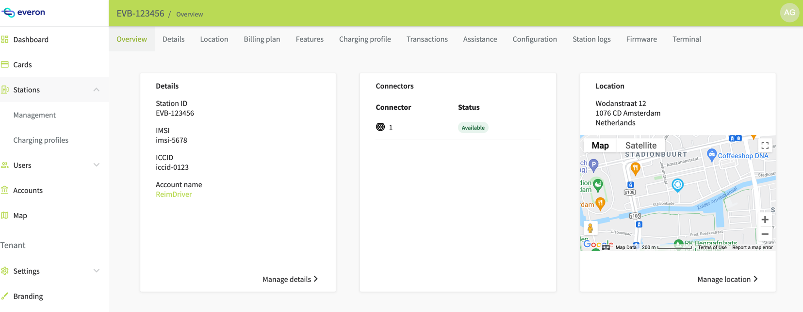
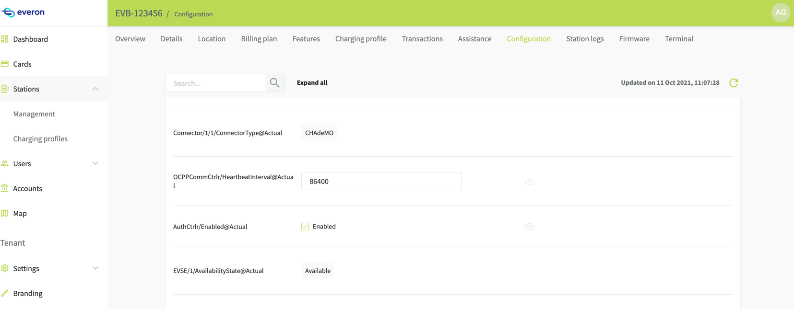
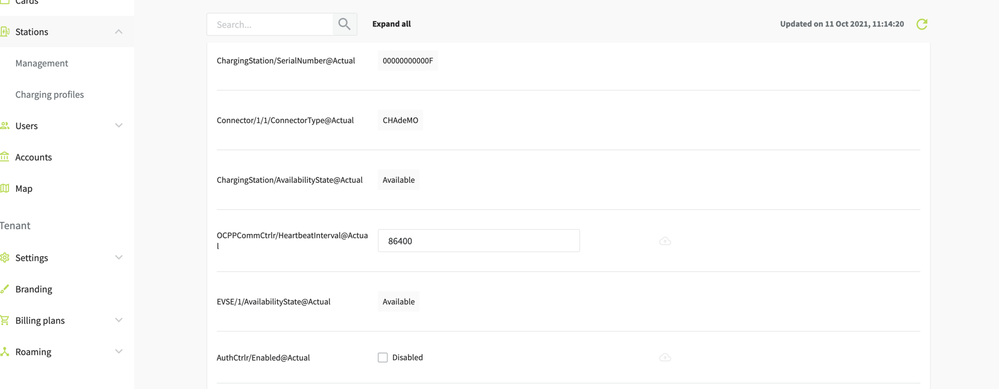
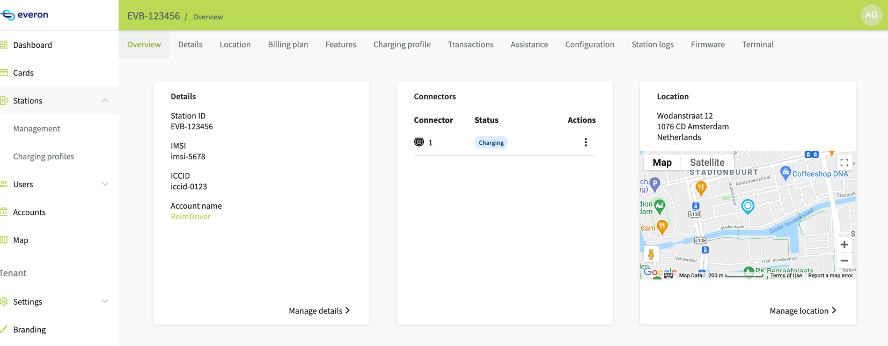
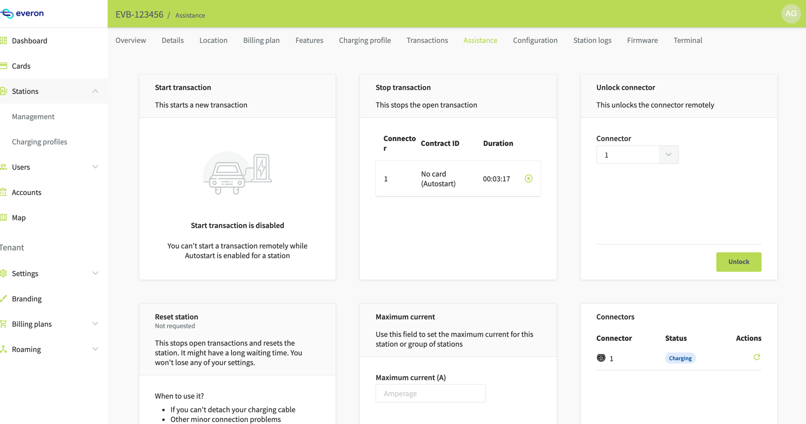
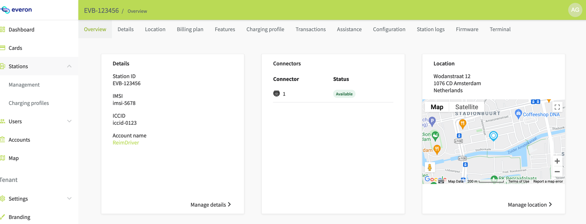
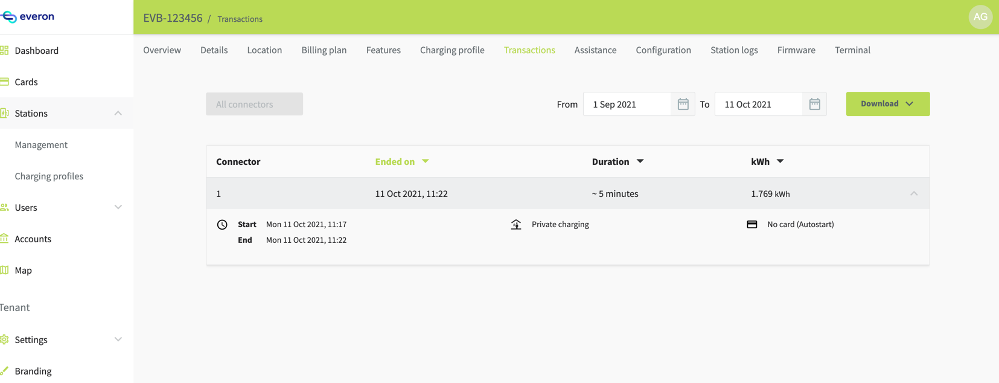

## OCPP Station Simulator - Autostart Scenario

Below guide shows using station simulator on Autostart/Instant charging mode. This makes use of the latest station
simulator running against any everon environment.

1. Import and activate a station on Everon - [Guide](https://docs.everon.io/software/managing-stations)
2. Start station simulator [Guide](https://github.com/everonhq/station-simulator#usage) - Note: Keep this instance of
   the simulator running throughout the remaining steps.

   Example for Everon production environment, station identity code - EVB-123456

    ```bash
    $ ./gradlew run -Parguments="ws://everon.io/ocpp --configuration {'stations':[{'id':'EVB-123456','evse':{'count':1,'connectors':1}}]}"
    ```

   Everon station management screen should show connector status as Available

   

   Station simulator screen

   ```bash
   ./gradlew run -Parguments="ws://everon.io/ocpp --configuration {'stations':[{'id':'EVB-123456','evse':{'count':1,'connectors':1}}]}"

   > Task :simulator-core:run

   List of stations:
   [SELECTED]: EVB-123456
   Available commands:
   plug {evseId} {connectorId} - plug cable to given connector
   unplug {evseId} {connectorId} - unplug cable from given connector
   auth {tokenId} {evseId} - authorize token at given EVSE
   profile3 {endpoint} - switch to security profile 3
   cert - print certificate of the station
   stat - show state of selected station
   ```

   Note: At this point in time, the station lacks the Autostart capability, can be verified via capability API:

   ```
   POST https://api.everon.io/api/stations/v1/3b109cc5-46c2-4e52-9761-77e4a5267903/capabilities/AUTO_START:read
   header -  Authorization : Bearer <token>
   Response: 
   {
    "enabled": "false"
   }
   ```

   Same can be seen when reloading configuration from station in Everon.

   AuthCtrlr/Enabled@Actual : true

   

3. Enable Autostart for station

   ```
   POST https://api.everon.io/api/stations/v1/3b109cc5-46c2-4e52-9761-77e4a5267903/capabilities/AUTO_START:write
   header -  Authorization : Bearer <token>
             Content-Type : application/json
   Request body:
   {
    "enabled": "true"
   }
   Response:
   {
   "enabled": "true"
   }
   ```
   Commands sent to station can be verified in station logs page and updated value can be seen in Everon configuration
   screen.

   AuthCtrlr/Enabled@Actual : false

   

4. Simulate Cable plugIn from simulator
   ```
   plug 1 1
   ```
   This will start a charging transaction . Evse status is shown as charging

   

   On-going transaction can be seen in assistance page of Everon

   

5. Simulate Unplug from simulator

   ```
   unplug 1 1
   ```

   Evse is now available

   

   Completed transaction can be seen in Everon Transaction tab

   

5b. Alternatively transaction can be stopped via Remote stop command.